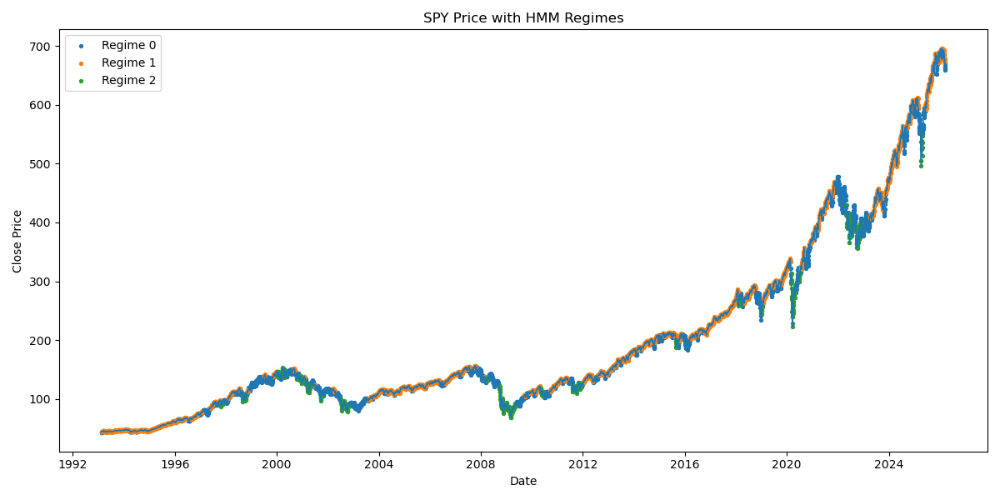
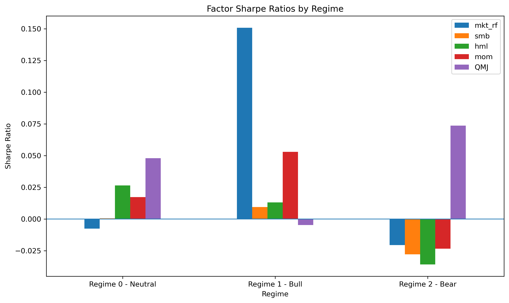

# Regime Factor Research

This project aims to rebuild and extend regime-based factor investing models from academic literature.

## Observation

We observe that factor performance is regime-dependent. In particular:

- The market factor (MKT-RF) exhibits high Sharpe ratios in low-volatility (bull) regimes and negative Sharpe in high-volatility (bear) regimes.

- Momentum shows a clear regime dependence: it performs well in bull regimes but delivers negative Sharpe ratios during bear regimes, consistent with known "momentum crash" phenomena.

- SMB and HML display weaker and less consistent regime dependence.

We compute Sharpe ratios of standard factors (MKT, SMB, HML, MOM) across HMM-inferred market regimes.

Key findings:

- Market factor (MKT-RF) delivers high Sharpe in bull regimes and negative Sharpe in bear regimes.

- Momentum (MOM) shows strong regime dependence, with positive Sharpe in bull regimes but negative Sharpe in bear regimes, consistent with known momentum crash behavior.

- SMB and HML exhibit weaker and less consistent regime dependence.

These results confirm that factor returns are not stationary and depend significantly on underlying market regimes.

## Visualization

### SPY Price with HMM Regimes

### Factor Sharpe by Regime

## Data Sources

- **S&P 500 ETF / market proxy**
  - Yahoo Finance (for OHLC price history used in regime-feature construction)

- **Kenneth French Data Library**
  - Main library:
    - https://mba.tuck.dartmouth.edu/pages/faculty/ken.french/data_library.html
  - Fama/French factors:
    - https://mba.tuck.dartmouth.edu/pages/faculty/ken.french/Data_Library/f-f_factors.html
  - Momentum factor:
    - Daily:
      - https://mba.tuck.dartmouth.edu/pages/faculty/ken.french/Data_Library/det_mom_factor_daily.html
    - Monthly:
      - https://mba.tuck.dartmouth.edu/pages/faculty/ken.french/data_library/det_mom_factor.html

- **AQR Data Library (Quality Minus Junk, QMJ)**
  - Dataset index:
    - https://www.aqr.com/Insights/Datasets
  - QMJ Daily:
    - https://www.aqr.com/Insights/Datasets/Quality-Minus-Junk-Factors-Daily
  - QMJ Monthly:
    - https://www.aqr.com/Insights/Datasets/Quality-Minus-Junk-Factors-Monthly
